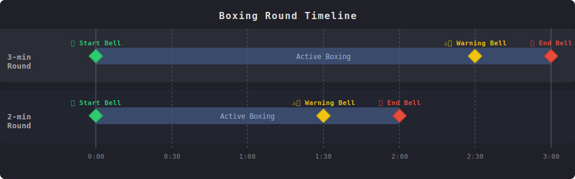

# Boxing Video 

Purpose of this project is to automatically parse long boxing videos into individual rounds. 
This process is done in 2 steps. First, the audio process where the mp3 file is extracted from the mp4 video file. 
Within the audio file, locate the bells from the audio, and locate the start and end of the rounds.
Second, based on the rounds identified by the bell, slice the video into rounds and save the videos (with watermark).

*image generated by Claude.ai*

